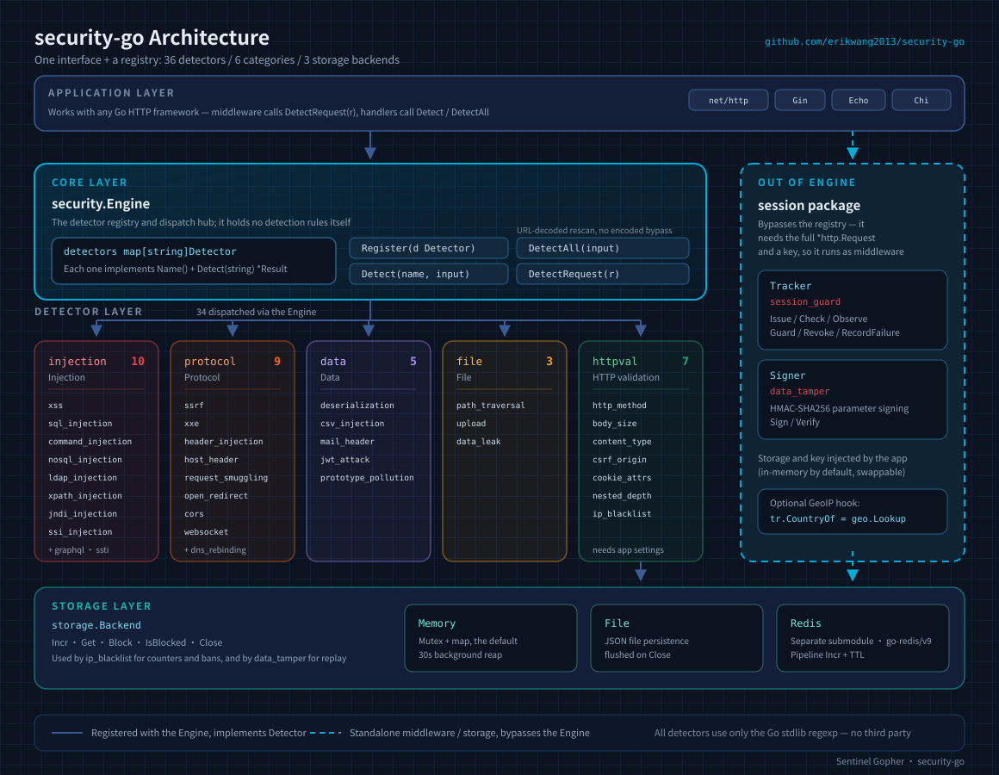
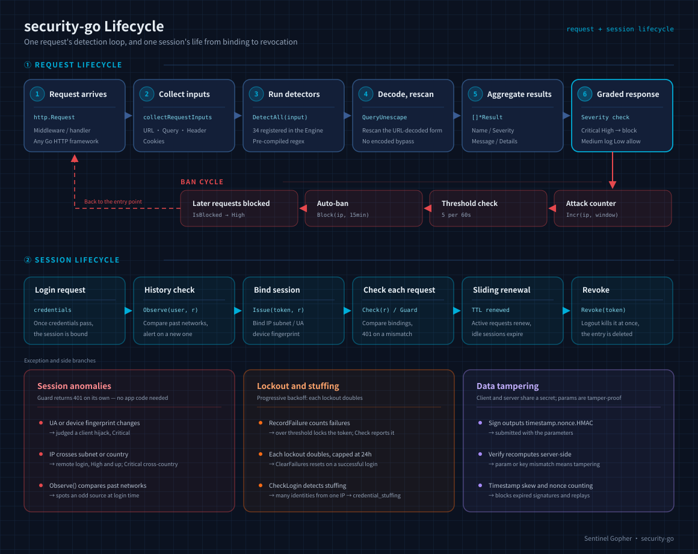
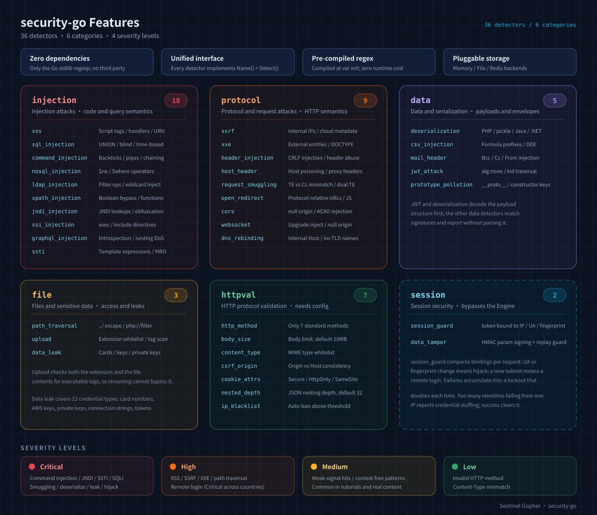

# Security Go — Attack Detection Library

[中文](README.md) · [API Reference](docs/api.md)

A pure Go attack detection library with **36 detectors** across **6 categories**, **3 pluggable storage backends**, and a unified `Detector` interface + `Engine` registry. Zero external dependencies for all detection logic.

<p align="center">
  
  <br>
  <sub>Project mascot <b>Sentinel Gopher</b> (哨兵鼠) — a Go gopher standing sentinel with a shield.<br>The <b>36</b> on the shield is the detector count; the magnifier is the per-request scan.</sub>
</p>

[Architecture](#architecture) · [Features](#features) · [Lifecycle](#lifecycle) · [Project Layout](#project-layout) · [The Mascot](#the-mascot)

## Design

### Core Principles

- **Zero-dependency detection** — all detectors use only Go standard library `regexp`, no external dependencies
- **Unified interface** — every detector implements the `Detector` interface (`Name()` + `Detect()`), managed through the `Engine` registry
- **Pre-compiled regex** — all patterns compiled in `var` blocks, zero runtime overhead
- **On-demand config** — injection/protocol/data/file detectors are plug-and-play; HTTP validators and session security detection require app-specific configuration

### Architecture



> The `session` package is not registered with the `Engine`: session validation must read the complete `*http.Request` (token, client IP, User-Agent),
> and requires the application to provide storage and a secret key, so it is called directly as middleware — see "Session Security Configuration" below.

### Lifecycle

The full loop of a request, from entry through detection to graded handling (including the IP ban cycle and the URL-decode rescan), plus a session's journey from binding to revocation:



### Severity Levels

| Level | Description | Typical Scenario |
|-------|-------------|-----------------|
| `SeverityLow` | Low risk | Invalid HTTP method, Content-Type mismatch |
| `SeverityMedium` | Medium risk | Weak-signal hits: CORS misconfiguration, open redirect, GraphQL introspection, plus the context-free patterns each detector deliberately separates (`../`, `on…=`, `javascript:`, `sleep(`, `sqlite_master`, backticks, `{#…#}`, `__proto__:`, PHP magic-method names), which are common in tutorials and ordinary content |
| `SeverityHigh` | High risk | Strong-signal hits: XSS, SQL injection, SSRF, path traversal, session anomalies |
| `SeverityCritical` | Critical | Strong-signal hits: command injection, JNDI, SSTI, XXE, data leak, deserialization (PHP serialized objects / pickle / Java / .NET) |

## Features

### Feature Overview



### Injection Attacks (10)

| Detector | Detection Patterns |
|----------|-------------------|
| **XSS** | `<script>`, `on[a-z]+=` handlers, `javascript:` pseudo-protocol, SVG/CSS injection, `eval()`, `document.cookie` |
| **SQL Injection** | `UNION SELECT` (incl. `/**/` bypass), `sleep/benchmark/pg_sleep`, boolean blind, `information_schema` enumeration, `xp_cmdshell` |
| **Command Injection** | Backticks, `$()`, pipes, `/dev/tcp`, PHP `system/exec/shell_exec`, chained `&&` `;` `\|\|` |
| **NoSQL Injection** | MongoDB `$ne` `$gt` `$regex` `$where` operators, `$func`, JSON key injection |
| **LDAP Injection** | Filter operators `(\|(&(!`, `objectClass=*`, URL encoding bypass |
| **XPATH Injection** | Boolean bypass `' or '1'='1`, `string-length()`, `count()` |
| **JNDI/Log4Shell** | `${jndi:ldap://`, `${lower:j}` obfuscation, `${env:}` env vars, `ldap/rmi/dns` protocols |
| **SSI Injection** | `<!--#exec cmd=`, `<!--#include file=`, `<!--#echo var=` |
| **GraphQL Injection** | `__schema`/`__type` introspection, deep nesting DoS (5+ levels), `mutation` detection |
| **SSTI** | Jinja2 `{{}}`, FreeMarker `${}`, ERB `<% %>`, Python MRO traversal, `config/self` access |

### Protocol & Request Attacks (9)

| Detector | Detection Patterns |
|----------|-------------------|
| **SSRF** | Internal IPs (127/10/172.16/192.168), `169.254.169.254`, IPv6 loopback, `gopher/dict/file/ftp` protocols |
| **XXE** | `<!ENTITY SYSTEM/PUBLIC`, parameter entities `%entity;`, DOCTYPE declarations |
| **HTTP Header Injection** | CRLF `%0d%0a` / `\r\n`, Set-Cookie/Location/Content-Length injection |
| **Host Header Attack** | CRLF Host injection, `X-Forwarded-Host`, `X-Original-URL` poisoning |
| **Request Smuggling** | Transfer-Encoding/Content-Length mismatch, dual TE headers, `\x0b` folding |
| **Open Redirect** | `//evil.com` protocol-relative URL, `javascript:/data:` pseudo-protocols |
| **CORS Bypass** | `Origin: null`, `Access-Control-Allow-*` header injection |
| **WebSocket Hijack** | Upgrade header injection, null Origin bypass, `ws://` URLs |
| **DNS Rebinding** | Host header with internal IP, localhost, short hostname without TLD |

### HTTP Validation (7)

| Detector | Description |
|----------|-------------|
| **JSON Nesting Depth** | Streams with `json.Decoder`; flags a JSON bomb when nesting depth or element count exceeds the limit (default depth 32). Malformed or truncated JSON never alerts |
| **Set-Cookie Attributes** | Flags `Set-Cookie` missing `Secure`/`HttpOnly`/`SameSite`, an overlong value, or an empty value; all missing attributes in one result |
| **HTTP Method** | Only allows GET/POST/PUT/DELETE/HEAD/OPTIONS/PATCH |
| **Body Size** | Alerts when body exceeds limit (default 10MB) |
| **Content-Type** | Only allows configured MIME type whitelist |
| **CSRF Origin** | Checks cross-origin request Origin against Host, supports additional whitelist |
| **IP Blacklist** | Auto-blocks IP after N attacks in window (default: 5/60s → 15min ban), supports File/Redis/Memory backends |

### Data & Serialization Attacks (5)

| Detector | Detection Patterns |
|----------|-------------------|
| **Deserialization** | `O:number:` / `C:number:` serialized objects, `unserialize()`, magic methods; covers PHP / pickle / Java / .NET payloads |
| **CSV Injection** | `=cmd\|`, `@SUM(`, `+`/`-` formula prefixes, `HYPERLINK`/`DDE` |
| **Mail Header Injection** | Bcc/Cc/From/To injection, MIME multipart, boundary params |
| **JWT Attack** | `alg: none` bypass, `kid` path traversal, empty signature detection (structural decode) |
| **Prototype Pollution** | `__proto__`/`constructor` keys, `__defineGetter__`/`__defineSetter__` |

### File & Sensitive Data (3)

| Detector | Detection Patterns |
|----------|-------------------|
| **Path Traversal** | `../`, `..\\`, `php://filter`/`php://input`, null byte, URL-encoded bypass, `/etc/passwd` |
| **Malicious Upload** | Extension whitelist (15 types) + PHP tag `<?php`/`<?=` content scan |
| **Data Leak** | Credit card numbers, AWS Access Key, private keys, DB connection strings, API tokens, JWT secrets, GitHub PAT |

### Session Security (2)

| Detector | Detection Patterns |
|----------|-------------------|
| **Session Guard** (`session_guard`) | Binds the token to the client that established the session and compares on every request: a change in User-Agent or device fingerprint is judged **client hijacking** (Critical); a client IP landing in another subnet or country is judged **remote login** (High/Critical); `Observe()` compares the login network against history at login time and alerts whenever a new subnet appears. Sessions slide-renew, and `Revoke()` invalidates immediately; `RecordFailure()` counts failed attempts and locks the token once the threshold is hit inside the window, `Check()` then reports `token_locked`, and `ClearFailures()` resets the count on a successful login; `CheckLogin()` additionally catches credential stuffing (one client failing against too many distinct identities reports `credential_stuffing`), and the lockout doubles on each repeat, capped at 24h |
| **Data Tampering** (`data_tamper`) | HMAC-SHA256 signature over the request parameters (`timestamp.nonce.signature`), identifying altered parameters, key mismatch, timestamp skew, and signature replay (nonce counter) |

### Storage Backends (3)

| Backend | Description |
|---------|-------------|
| **Memory** | `sync.Mutex` + map, 30s TTL cleanup |
| **File** | JSON persistence, auto-save every 30s + flush on Close |
| **Redis** | Separate sub-module, Pipeline Incr + TTL, requires `go-redis/v9` |

## Project Layout

```
security-go/
├── security.go            # Core: Result / Severity / Detector interface / Engine registry
├── injection/             # Injection detectors (10): xss, sql, command, nosql, ldap,
│                          #   xpath, jndi, ssi, graphql, ssti
├── protocol/              # Protocol and request detectors (9): ssrf, xxe, header, host,
│                          #   smuggling, redirect, cors, websocket, dns_rebinding
├── data/                  # Data and serialization detectors (5): deserialization, csv,
│                          #   mail, jwt, prototype_pollution
├── file/                  # File and sensitive-data detectors (3): path_traversal,
│                          #   upload, data_leak
├── httpval/               # HTTP protocol validators (7), each needs app-supplied settings
├── session/               # Session security (2): session_guard, data_tamper
│                          #   Bypasses the Engine and is used directly as middleware
├── storage/               # Storage backends
│   ├── storage.go         #   Backend interface: Incr / Get / Block / IsBlocked / Close
│   ├── memory.go          #   Memory: Mutex + map, 30s background reap
│   ├── file.go            #   File: JSON persistence, flushed on Close
│   └── redis/             #   Redis: separate submodule with its own go.mod
├── all/                   # One-call registration of the 27 zero-config detectors
├── pet/                   # Project mascot: embedded SVG (Calm/Watchful/Alarmed) + startup banner
├── docs/
│   ├── api.md             # API reference
│   ├── images/            # Architecture / feature / lifecycle SVGs
│   ├── i18n/              # Translated documentation (12 languages)
│   └── superpowers/       # Design spec, implementation plan, code review reports
└── tests/                 # Coverage reports
```

Each detector package pairs `xxx.go` with `xxx_test.go`; `all` additionally carries regression tests.

## Usage

### Installation

```bash
go get github.com/erikwang2013/security-go
```

### Quick Start

```go
package main

import (
    "fmt"
    "github.com/erikwang2013/security-go"
    "github.com/erikwang2013/security-go/all"
)

func main() {
    e := security.NewEngine()
    all.RegisterAll(e) // register all 27 zero-config detectors

    // Single detection
    r := e.Detect("xss", "<script>alert(1)</script>")
    fmt.Printf("Detected: %v, Severity: %d\n", r.Detected, r.Severity)

    // Batch detection
    for _, r := range e.DetectAll("' OR '1'='1") {
        fmt.Printf("[%s] %s\n", r.Name, r.Message)
    }
}
```

### HTTP Request Detection

```go
func handler(w http.ResponseWriter, r *http.Request) {
    e := security.NewEngine()
    all.RegisterAll(e)

    for _, result := range e.DetectRequest(r) {
        if result.Detected {
            log.Printf("Attack detected: [%s] %s", result.Name, result.Message)
        }
    }
}
```

### HTTP Validator Configuration

```go
// Method validation
e.Register(&httpval.Method{})

// Body size limit
e.Register(httpval.NewBodySize(5 * 1024 * 1024)) // 5MB

// Content-Type whitelist
e.Register(httpval.NewContentType([]string{
    "application/json", "application/x-www-form-urlencoded",
}))

// CSRF Origin check
e.Register(&httpval.CSRFOrigin{
    Host: "example.com", AllowList: []string{"api.example.com"},
})

// IP blacklist (auto-ban: 5 attacks/60s → 15min ban)
mem := storage.NewMemory()
defer mem.Close()
bl := httpval.NewIPBlacklist(mem)
e.Register(bl)

// Record attack
blocked, _ := bl.RecordAttack(clientIP)
```

### Session Security Configuration

The `session` package is used directly as middleware, without going through the `Engine`. Storage must be provided by the application (an in-memory implementation is available by default and can be replaced with Redis, etc.):

```go
import "github.com/erikwang2013/security-go/session"

st := session.NewMemoryStore()
defer st.Close()

tr := session.NewTracker(st)
tr.CountryOf = geo.Lookup // optional: wire up GeoIP to detect cross-country logins

// after a successful login, bind the session (the token comes from your login flow)
// new-location check: compares against the user's past login networks, alerts on a new one
if res := tr.Observe("user-1", r); res.Detected {
    log.Printf("[%s] %s (%v)", res.Name, res.Message, res.Details["reason"])
}
if err := tr.Issue(token, r); err != nil {      // binds token -> IP subnet / UA / device fingerprint
    http.Error(w, "session error", http.StatusInternalServerError)
    return
}

// protected routes: a hijack or new-location hit returns 401
mux.Handle("/api/", tr.Guard(apiHandler))

// or detect only and decide the response yourself
if res := tr.Check(r); res.Detected {
    log.Printf("[%s] %s (%v)", res.Name, res.Message, res.Details["reason"])
}

// log out
tr.Revoke(token)
```

Data tamper detection: the client and server share a secret; the client signs the parameters and the server recomputes and verifies:

```go
signer := session.NewSigner(secret, storage.NewMemory()) // the second argument blocks signature replay; may be nil

sig, _ := signer.Sign(map[string]string{"amount": "100", "to": "bob"}) // client side: submit alongside the parameters

if res := signer.Verify(map[string]string{"amount": "100", "to": "bob"}, sig); res.Detected {
    log.Printf("[%s] %s (%v)", res.Name, res.Message, res.Details["reason"])
}
```

> `TrustProxyHeaders` is disabled by default: `X-Forwarded-For` / `X-Real-IP` are client-controllable, so enable it only behind your own reverse proxy.
> `FailClosed` is disabled by default (requests pass through on storage failure, consistent with `IPBlacklist`); enabling it is recommended for session-sensitive services.

### Custom Detector

```go
type MyDetector struct{}

func (d *MyDetector) Name() string { return "my_detector" }

func (d *MyDetector) Detect(input string) *security.Result {
    return &security.Result{
        Name: "my_detector", Detected: strings.Contains(input, "evil"),
        Severity: security.SeverityHigh, Message: "Malicious content detected",
    }
}

e.Register(&MyDetector{})
```

### The Mascot

The `pet` package embeds the Sentinel Gopher as SVG at compile time via `go:embed` — no runtime file dependency, no third-party dependency added:

```go
import "github.com/erikwang2013/security-go/pet"

log.Println(pet.Banner())              // startup banner: terminal-friendly plain text
http.Handle("/pet.svg", pet.Handler()) // debug route: served as image/svg+xml, cached a day
svg := pet.SVG()                       // or take the raw SVG bytes
```

The mascot is not a static image — it is driven by **detection results**. `pet.MoodOf` sorts one scan into three postures, and the shield, radar and magnifier recolour to match:

| Mood | Fires when | Looks like |
|------|-----------|------------|
| `Calm` | the scan is clean | cyan (the static image above) |
| `Watchful` | something fired, nothing High or Critical | amber |
| `Alarmed` | at least one High or Critical | red, with an alert ring |

<p align="center">
  
  
  
  <br>
  <sub><b>Calm</b> · <b>Watchful</b> · <b>Alarmed</b></sub>
</p>

Wire it to the engine and you get a threat-state image that tracks live traffic:

```go
http.Handle("/pet.svg", pet.MoodHandler(func(r *http.Request) pet.Mood {
    return pet.MoodOf(e.DetectRequest(r))
}))
```

`MoodHandler` sends `Cache-Control: no-store` — unlike the static `Handler`, its output changes per scan, so caching it a day would serve a stale posture.

### Documentation

- [API Reference](docs/api.md) — Core types, Detector/Engine interfaces, storage Backend, HTTP validators
- [Design Spec](docs/superpowers/specs/2026-07-29-attack-detection-design-en.md) — Package structure, detector catalog
- [Implementation Plan](docs/superpowers/plans/2026-07-29-attack-detection-plan-en.md) — Task-by-task plan with actual vs planned deviations
- [Code Review Report](docs/superpowers/reports/2026-07-29-code-review-report-en.md) — Bug fixes, test coverage, architecture review
- [Code Review Report v2](docs/i18n/en/reports/2026-07-29-code-review-report-v2.md) — Second pass: 4 issues fixed, 18 test files added

---

## Languages

| Language | Document |
|----------|----------|
| 简体中文 | [README.md](README.md) |
| English | [README-EN.md](README-EN.md) · [docs/i18n/en/README.md](docs/i18n/en/README.md) |
| 한국어 | [docs/i18n/ko/README.md](docs/i18n/ko/README.md) |
| Русский | [docs/i18n/ru/README.md](docs/i18n/ru/README.md) |
| Deutsch | [docs/i18n/de/README.md](docs/i18n/de/README.md) |
| Français | [docs/i18n/fr/README.md](docs/i18n/fr/README.md) |
| Español | [docs/i18n/es/README.md](docs/i18n/es/README.md) |
| Português | [docs/i18n/pt/README.md](docs/i18n/pt/README.md) |
| हिन्दी | [docs/i18n/hi/README.md](docs/i18n/hi/README.md) |
| العربية | [docs/i18n/ar/README.md](docs/i18n/ar/README.md) |
| বাংলা | [docs/i18n/bn/README.md](docs/i18n/bn/README.md) |
| Bahasa Indonesia | [docs/i18n/id/README.md](docs/i18n/id/README.md) |
| 日本語 | [docs/i18n/ja/README.md](docs/i18n/ja/README.md) |

---

## Donate

If this project helps you, donations are welcome:

| Method | QR Code |
|--------|---------|
| Alipay |  |
| WeChat Pay |  |

### Global Bank Transfer

**Payee Information**

- Payee Name: WANG KEXUN
- Payee Account Number: 881015918251

**Receiving Bank (ZA Bank)**

- SWIFT Code: `AABLHKHHXXX`
- Bank Name: ZA Bank Limited
- Bank Code: 387
- Bank Address: Core F, Cyberport 3, 100 Cyberport Road, Hong Kong

**Correspondent Bank for Cross-Border Transfers (if required)**

> Please note: this is the correspondent (intermediary) bank information, NOT the receiving bank information. Please check with your remitting bank whether correspondent bank details are required.

- For HKD, CNY, and USD transfers, the correspondent bank is Citibank:
  - Bank Name: Citibank N.A. Hong Kong
  - SWIFT Code: `CITIHKHXXXX`
  - Bank Code: 006
  - Branch Name: Hong Kong Branch
  - Branch Code: 391
  - Bank Address: Citibank Tower, Citibank Plaza, 3 Garden Road, Central, Hong Kong
- For transfers in other currencies, the correspondent bank is BNY Mellon:
  - Bank Name: THE BANK OF NEW YORK MELLON
  - SWIFT Code: `IRVTUS3NXXX`
  - Bank Address: THE BANK OF NEW YORK MELLON, 240 GREENWICH STREET, NEW YORK, United States

---

Copyright (c) 2026 erik <erik@erik.xyz> — https://erik.xyz
