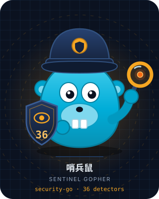
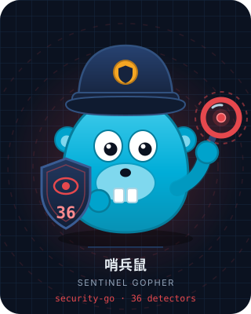

# Security Go — pustaka deteksi serangan

[简体中文](../../../README.md) · [English](../../../README-EN.md) · [Dokumentasi API](api.md)

Pustaka deteksi serangan yang ditulis dalam bahasa Go, mencakup **36 detektor**, **6 kategori serangan utama**, dan **3 backend penyimpanan yang dapat dipasang**. Antarmuka terpadu + pola registry, murni pustaka deteksi, cocok untuk kerangka HTTP Go mana pun.

<p align="center">
  
  <br>
  <sub>Maskot proyek Sentinel Gopher (哨兵鼠) — gopher Go yang berdiri berjaga dengan perisai. Angka 36 pada perisai adalah jumlah detektor; kaca pembesar melambangkan pemindaian pada setiap permintaan.</sub>
</p>

[Arsitektur](#arsitektur-desain) · [Fitur](#fitur-yang-diimplementasikan) · [Siklus Hidup](#siklus-hidup) · [Struktur Proyek](#struktur-proyek) · [Maskot](#maskot)

## Konsep Desain

### Prinsip Inti

- **Deteksi tanpa dependensi** — semua detektor hanya menggunakan `regexp` dari pustaka standar Go, tanpa dependensi eksternal
- **Antarmuka terpadu** — setiap detektor mengimplementasikan antarmuka `Detector` (`Name()` + `Detect()`), dikelola secara terpadu melalui registry `Engine`
- **Regex pra-kompilasi** — semua pola dikompilasi saat inisialisasi `var`, tanpa overhead saat runtime
- **Konfigurasi sesuai kebutuhan** — detektor injeksi/protokol/data/file bersifat plug-and-play; validator HTTP dan deteksi keamanan sesi memerlukan konfigurasi kustom aplikasi

### Arsitektur Desain


> Paket `session` tidak didaftarkan melalui `Engine`: validasi sesi harus membaca `*http.Request` secara lengkap (token, IP klien, User-Agent),
> dan memerlukan penyimpanan serta kunci dari aplikasi, sehingga dipanggil langsung sebagai middleware, lihat bagian "Konfigurasi Keamanan Sesi" di bawah.

### Siklus Hidup

Siklus lengkap sebuah permintaan, dari masuk hingga deteksi lalu penanganan bertingkat (termasuk siklus blokir IP dan pemindaian ulang setelah decode URL), serta perjalanan sesi dari pengikatan hingga pencabutan:


### Tingkat Keparahan

| Tingkat | Keterangan | Skenario Umum |
|------|------|---------|
| `SeverityLow` | Risiko rendah | Metode HTTP tidak sah, Content-Type tidak cocok |
| `SeverityMedium` | Risiko sedang | Sinyal lemah: salah konfigurasi CORS, open redirect, introspeksi GraphQL, ditambah pola tanpa konteks yang sengaja dipisahkan tiap detektor (`../`, `on…=`, `javascript:`, `sleep(`, `sqlite_master`, backtick, `{#…#}`, `__proto__:`, nama magic method PHP) — lazim di tutorial dan konten biasa |
| `SeverityHigh` | Risiko tinggi | Sinyal kuat: XSS, injeksi SQL, SSRF, path traversal, anomali sesi |
| `SeverityCritical` | Kritis | Sinyal kuat: injeksi perintah, JNDI, SSTI, XXE, kebocoran data, deserialisasi (objek terserialisasi PHP / pickle / Java / .NET) |

## Fitur yang Diimplementasikan

### Ringkasan Fitur


### Serangan Injeksi (10)

| Detektor | Pola Deteksi |
|--------|---------|
| **XSS** | `<script>`, event handler `on[a-z]+=`, protokol palsu `javascript:`, injeksi SVG/CSS, `eval()`, `document.cookie` |
| **Injeksi SQL** | `UNION SELECT` (termasuk bypass `/**/`), `sleep/benchmark/pg_sleep`, blind boolean, enumerasi `information_schema`, `xp_cmdshell` |
| **Injeksi Perintah** | backtick, `$()`, karakter pipe, `/dev/tcp`, `system/exec/shell_exec` PHP, eksekusi berantai `&&` `;` `\|\|` |
| **Injeksi NoSQL** | Operator MongoDB `$ne` `$gt` `$regex` `$where`, `$func`, injeksi kunci JSON |
| **Injeksi LDAP** | Operator filter `(\|(&(!`, `objectClass=*`, bypass encoding URL |
| **Injeksi XPATH** | Bypass boolean `' or '1'='1`, `string-length()`, `count()` |
| **JNDI/Log4Shell** | `${jndi:ldap://`, obfuskasi `${lower:j}`, variabel lingkungan `${env:}`, protokol `ldap/rmi/dns` |
| **Injeksi SSI** | `<!--#exec cmd=`, `<!--#include file=`, `<!--#echo var=` |
| **Injeksi GraphQL** | Introspeksi `__schema`/`__type`, DoS nested dalam (5+ lapis), deteksi `mutation` |
| **SSTI** | Jinja2 `{{}}`, FreeMarker `${}`, ERB `<% %>`, traversi MRO Python, akses `config/self` |

### Serangan Protokol & Permintaan (9)

| Detektor | Pola Deteksi |
|--------|---------|
| **SSRF** | IP internal (127/10/172.16/192.168), `169.254.169.254`, IPv6 loopback, protokol `gopher/dict/file/ftp` |
| **XXE** | `<!ENTITY SYSTEM/PUBLIC`, entitas parameter `%entity;`, deklarasi DOCTYPE |
| **Injeksi Header HTTP** | CRLF `%0d%0a` / `\r\n`, injeksi Set-Cookie/Location/Content-Length |
| **Serangan Host Header** | Injeksi Host CRLF, poisoning `X-Forwarded-Host`, `X-Original-URL` |
| **Request Smuggling** | Ketidakcocokan Transfer-Encoding/Content-Length, header TE ganda, kebingungan header terlipat `\x0b` |
| **Open Redirect** | URL relatif protokol `//evil.com`, protokol palsu `javascript:/data:` |
| **Bypass CORS** | `Origin: null`, injeksi header `Access-Control-Allow-*` |
| **Pembajakan WebSocket** | Injeksi header Upgrade, bypass Origin null, URL `ws://` |
| **DNS Rebinding** | IP internal pada Host header, localhost, nama host pendek tanpa TLD |

### Validasi Lapisan Protokol HTTP (7)
| **Kedalaman Penyarangan JSON** | Memindai secara streaming dengan `json.Decoder`: menandai bom JSON saat kedalaman atau jumlah elemen melewati batas (kedalaman bawaan 32). JSON tidak valid atau terpotong tidak pernah memicu |
| **Atribut Set-Cookie** | Menandai `Set-Cookie` tanpa `Secure`/`HttpOnly`/`SameSite`, nilai terlalu panjang, atau nilai kosong; atribut yang hilang digabung dalam satu hasil |

| Detektor | Keterangan |
|--------|------|
| **Metode HTTP** | Hanya mengizinkan GET/POST/PUT/DELETE/HEAD/OPTIONS/PATCH, lainnya mengembalikan peringatan |
| **Ukuran Body Permintaan** | Melebihi batas (default 10MB) memicu peringatan |
| **Content-Type** | Hanya mengizinkan daftar putih tipe MIME yang dikonfigurasi |
| **CSRF Origin** | Mendeteksi apakah Origin permintaan lintas domain cocok dengan Host, mendukung daftar putih tambahan |
| **IP Blacklist** | Blokir otomatis setelah N kali serangan dalam jendela waktu (default 5x/60s → blokir 15 menit), mendukung penyimpanan File/Redis/Memory |

### Serangan Data & Serialisasi (5)

| Detektor | Pola Deteksi |
|--------|---------|
| **Deserialisasi** | Objek serialisasi `O:angka:` / `C:angka:`, `unserialize()`, metode ajaib (`__wakeup`/`__destruct`); mencakup muatan PHP / pickle / Java / .NET |
| **Injeksi CSV** | `=cmd\|`, `@SUM(`, prefiks rumus `+`/`-`, `HYPERLINK`/`DDE` |
| **Injeksi Header Email** | Injeksi Bcc/Cc/From/To, MIME multipart, parameter boundary |
| **Serangan JWT** | Bypass `alg: none`, path traversal `kid`, deteksi tanda tangan kosong (analisis decoding struktur) |
| **Polusi Prototipe** | Kunci `__proto__`/`constructor`, `__defineGetter__`/`__defineSetter__` |

### File & Data Sensitif (3)

| Detektor | Pola Deteksi |
|--------|---------|
| **Path Traversal** | `../`, `..\\`, `php://filter`/`php://input`, null byte, bypass encoding URL, `/etc/passwd` |
| **Upload Berbahaya** | Daftar putih ekstensi (15 jenis) + pemindaian konten tag PHP `<?php`/`<?=` |
| **Kebocoran Data** | Nomor kartu kredit, AWS Access Key, kunci privat `-----BEGIN`, string koneksi database, API Token, JWT Secret, GitHub PAT |

### Keamanan Sesi (2)

| Detektor | Pola Deteksi |
|--------|---------|
| **Penjaga Sesi** (`session_guard`) | token diikat ke klien saat sesi dibuat, dibandingkan pada setiap permintaan: perubahan User-Agent atau sidik jari perangkat dianggap **klien dibajak** (Critical); IP klien jatuh ke subnet atau negara lain dianggap **login dari lokasi lain** (High/Critical); `Observe()` saat login membandingkan subnet historis, munculnya subnet baru langsung memicu peringatan. Sesi diperpanjang secara sliding, `Revoke()` dapat langsung membatalkan; `RecordFailure()` menghitung percobaan gagal dan mengunci token begitu ambang tercapai dalam jendela waktu, `Check()` lalu melaporkan `token_locked`, dan `ClearFailures()` mereset hitungan saat login berhasil; `CheckLogin()` juga menangkap credential stuffing (satu klien gagal terhadap terlalu banyak identitas berbeda → `credential_stuffing`), dan kunci berlipat dua tiap pengulangan, dibatasi 24 jam |
| **Manipulasi Data** (`data_tamper`) | Parameter permintaan ditandatangani dengan HMAC-SHA256 (`timestamp.nonce.signature`), mengidentifikasi perubahan parameter, ketidakcocokan kunci, selisih timestamp, dan pemutaran ulang tanda tangan (penghitung nonce) |

### Backend Penyimpanan (3)

| Backend | Keterangan |
|------|------|
| **Memory** | `sync.Mutex` + map, pembersihan otomatis entri kedaluwarsa setiap 30 detik |
| **File** | Persistensi file JSON, flush saat Close |
| **Redis** | Submodul terpisah, Pipeline Incr + TTL, memerlukan `go-redis/v9` |

## Struktur Proyek

```
security-go/
├── security.go            # Inti: Result / Severity / antarmuka Detector / registry Engine
├── injection/             # Detektor injeksi (10): xss, sql, command, nosql, ldap,
│                          #   xpath, jndi, ssi, graphql, ssti
├── protocol/              # Detektor protokol dan permintaan (9): ssrf, xxe, header, host,
│                          #   smuggling, redirect, cors, websocket, dns_rebinding
├── data/                  # Detektor data dan serialisasi (5): deserialization, csv,
│                          #   mail, jwt, prototype_pollution
├── file/                  # Detektor file dan data sensitif (3): path_traversal,
│                          #   upload, data_leak
├── httpval/               # Validator protokol HTTP (7), masing-masing butuh pengaturan dari aplikasi
├── session/               # Keamanan sesi (2): session_guard, data_tamper
│                          #   Melewati Engine dan dipakai langsung sebagai middleware
├── storage/               # Backend penyimpanan
│   ├── storage.go         #   Antarmuka Backend: Incr / Get / Block / IsBlocked / Close
│   ├── memory.go          #   Memory: Mutex + map, pembersihan latar tiap 30 detik
│   ├── file.go            #   File: persistensi JSON, flush saat Close
│   └── redis/             #   Redis: submodul terpisah dengan go.mod sendiri
├── all/                   # Registrasi sekali panggil untuk 27 detektor tanpa konfigurasi
├── pet/                   # Maskot proyek: SVG tertanam (Calm/Watchful/Alarmed) + banner startup
├── docs/
│   ├── api.md             # Referensi API
│   ├── images/            # SVG arsitektur / fitur / siklus hidup
│   ├── i18n/              # Dokumentasi terjemahan (12 bahasa)
│   └── superpowers/       # Spesifikasi desain, rencana implementasi, laporan code review
└── tests/                 # Laporan cakupan
```

Setiap paket detektor memasangkan `xxx.go` dengan `xxx_test.go`; `all` juga membawa tes regresi.

## Petunjuk Penggunaan

### Instalasi

```bash
go get github.com/erikwang2013/security-go
```

### Memulai dengan Cepat

```go
package main

import (
    "fmt"
    "github.com/erikwang2013/security-go"
    "github.com/erikwang2013/security-go/all"
)

func main() {
    e := security.NewEngine()
    all.RegisterAll(e) // daftarkan 27 detektor tanpa konfigurasi dalam satu panggilan

    // Deteksi tunggal
    r := e.Detect("xss", "<script>alert(1)</script>")
    fmt.Printf("Terdeteksi: %v, tingkat keparahan: %d\n", r.Detected, r.Severity)

    // Deteksi menyeluruh
    for _, r := range e.DetectAll("' OR '1'='1") {
        fmt.Printf("[%s] %s\n", r.Name, r.Message)
    }
}
```

### Deteksi Permintaan HTTP

```go
func handler(w http.ResponseWriter, r *http.Request) {
    e := security.NewEngine()
    all.RegisterAll(e)

    for _, result := range e.DetectRequest(r) {
        if result.Detected {
            log.Printf("Deteksi serangan: [%s] %s", result.Name, result.Message)
        }
    }
}
```

### Konfigurasi Validator HTTP

```go
// Validasi metode
e.Register(&httpval.Method{})

// Batas ukuran body permintaan
e.Register(httpval.NewBodySize(5 * 1024 * 1024)) // 5MB

// Daftar putih Content-Type
e.Register(httpval.NewContentType([]string{
    "application/json", "application/x-www-form-urlencoded",
}))

// Pemeriksaan CSRF Origin
e.Register(&httpval.CSRFOrigin{
    Host: "example.com", AllowList: []string{"api.example.com"},
})

// Daftar hitam IP (blokir otomatis: 5 kali/60s → blokir 15 menit)
mem := storage.NewMemory()
defer mem.Close()
bl := httpval.NewIPBlacklist(mem)
e.Register(bl)

// Catat saat serangan terjadi
blocked, _ := bl.RecordAttack(clientIP)
```

### Konfigurasi Keamanan Sesi

Paket `session` digunakan langsung sebagai middleware, tanpa melalui `Engine`. Penyimpanan perlu disiapkan aplikasi sendiri (implementasi memori tersedia secara default, dapat diganti dengan Redis dll):

```go
import "github.com/erikwang2013/security-go/session"

st := session.NewMemoryStore()
defer st.Close()

tr := session.NewTracker(st)
tr.CountryOf = geo.Lookup // Opsional: sambungkan GeoIP untuk mengenali login lintas negara

// Setelah login berhasil, ikat sesi (token dibuat oleh alur login Anda)
// Deteksi login dari lokasi lain: bandingkan subnet historis pengguna, beri peringatan saat subnet baru muncul
if res := tr.Observe("user-1", r); res.Detected {
    log.Printf("[%s] %s (%v)", res.Name, res.Message, res.Details["reason"])
}
if err := tr.Issue(token, r); err != nil {      // ikat token → subnet IP / UA / sidik jari perangkat
    http.Error(w, "session error", http.StatusInternalServerError)
    return
}

// Rute terlindungi: kembalikan langsung 401 bila terjadi pembajakan atau login dari lokasi lain
mux.Handle("/api/", tr.Guard(apiHandler))

// Atau hanya mendeteksi dan menentukan sendiri penanganannya
if res := tr.Check(r); res.Detected {
    log.Printf("[%s] %s (%v)", res.Name, res.Message, res.Details["reason"])
}

// Logout
tr.Revoke(token)
```

Deteksi manipulasi data: klien dan server berbagi kunci rahasia, klien menandatangani parameter, server menghitung ulang untuk verifikasi:

```go
signer := session.NewSigner(secret, storage.NewMemory()) // parameter kedua mencegat pemutaran ulang tanda tangan, boleh nil

sig, _ := signer.Sign(map[string]string{"amount": "100", "to": "bob"}) // klien: dikirim bersama parameter

if res := signer.Verify(map[string]string{"amount": "100", "to": "bob"}, sig); res.Detected {
    log.Printf("[%s] %s (%v)", res.Name, res.Message, res.Details["reason"])
}
```

> `TrustProxyHeaders` dinonaktifkan secara default: `X-Forwarded-For` / `X-Real-IP` dapat dikendalikan klien, aktifkan hanya di belakang reverse proxy sendiri.
> `FailClosed` dinonaktifkan secara default (lolos saat penyimpanan gagal, konsisten dengan `IPBlacklist`); sebaiknya aktifkan untuk bisnis yang sensitif terhadap sesi.

### Detektor Kustom

```go
type MyDetector struct{}

func (d *MyDetector) Name() string { return "my_detector" }

func (d *MyDetector) Detect(input string) *security.Result {
    return &security.Result{
        Name: "my_detector", Detected: strings.Contains(input, "evil"),
        Severity: security.SeverityHigh, Message: "Konten berbahaya terdeteksi",
    }
}

e.Register(&MyDetector{})
```

### Maskot

Paket `pet` menyematkan Sentinel Gopher sebagai SVG saat kompilasi melalui `go:embed` — tanpa ketergantungan berkas saat runtime, tanpa menambah dependensi pihak ketiga:

```go
import "github.com/erikwang2013/security-go/pet"

log.Println(pet.Banner())              // banner startup: teks polos yang ramah terminal
http.Handle("/pet.svg", pet.Handler()) // rute debug: disajikan sebagai image/svg+xml, di-cache sehari
svg := pet.SVG()                       // atau ambil byte SVG mentah
```

Maskot bukan gambar statis — ia digerakkan oleh **hasil deteksi**. `pet.MoodOf` membagi satu pemindaian ke dalam tiga postur, dan perisai, radar, serta kaca pembesar ikut berubah warna:

| Postur | Terpicu saat | Bentuk |
|------|-----------|------------|
| `Calm` | pemindaian tanpa hit | cyan (gambar statis di atas) |
| `Watchful` | ada hit, tetapi tidak ada High / Critical | amber |
| `Alarmed` | setidaknya satu High atau Critical | merah + cincin peringatan |

<p align="center">
  
  
  
  <br>
  <sub><b>Calm</b> · <b>Watchful</b> · <b>Alarmed</b></sub>
</p>

Sambungkan ke engine, dan hasilnya gambar status ancaman yang berubah mengikuti lalu lintas:

```go
http.Handle("/pet.svg", pet.MoodHandler(func(r *http.Request) pet.Mood {
    return pet.MoodOf(e.DetectRequest(r))
}))
```

`MoodHandler` membawa `Cache-Control: no-store` — berbeda dari `Handler` statis, keluarannya berubah mengikuti hasil pemindaian; cache sehari akan mengembalikan bentuk yang kedaluwarsa.

### Dokumentasi Terkait

- [Dokumentasi API](api.md) — tipe inti, antarmuka Detector/Engine, antarmuka backend penyimpanan, validator HTTP
- [Spesifikasi Desain](specs/2026-07-29-attack-detection-design.md) — struktur paket, katalog detektor
- [Rencana Implementasi](plans/2026-07-29-attack-detection-plan.md) — rencana tugas bertahap dan perbandingan deviasi implementasi
- [Laporan Code Review](reports/2026-07-29-code-review-report.md) — perbaikan Bug, cakupan pengujian, evaluasi arsitektur
- [Laporan Code Review v2](reports/2026-07-29-code-review-report-v2.md) — putaran kedua: 4 masalah diperbaiki, 18 file pengujian ditambahkan

---

## Dokumen Multibahasa

| Bahasa | Dokumen |
|------|------|
| 简体中文 | [README.md](../../../README.md) |
| English | [README-EN.md](../../../README-EN.md) · [docs/i18n/en/README.md](../en/README.md) |
| 한국어 | [docs/i18n/ko/README.md](../ko/README.md) |
| Русский | [docs/i18n/ru/README.md](../ru/README.md) |
| Deutsch | [docs/i18n/de/README.md](../de/README.md) |
| Français | [docs/i18n/fr/README.md](../fr/README.md) |
| Español | [docs/i18n/es/README.md](../es/README.md) |
| Português | [docs/i18n/pt/README.md](../pt/README.md) |
| हिन्दी | [docs/i18n/hi/README.md](../hi/README.md) |
| العربية | [docs/i18n/ar/README.md](../ar/README.md) |
| বাংলা | [docs/i18n/bn/README.md](../bn/README.md) |
| Bahasa Indonesia | [README.md](README.md) |
| 日本語 | [docs/i18n/ja/README.md](../ja/README.md) |

Indeks semua terjemahan: [docs/i18n/README.md](../README.md)

---

## Dukungan Donasi

Jika proyek ini bermanfaat bagi Anda, silakan berikan dukungan:

| Metode | Kode QR |
|------|--------|
| Alipay |  |
| WeChat Pay |  |

### Donasi Transfer Global (Transfer Bank)

**Informasi Penerima**

- Nama Penerima: WANG KEXUN
- Nomor Rekening Penerima: 881015918251

**Bank Penerima (ZA Bank)**

- Kode SWIFT: `AABLHKHHXXX`
- Nama Bank: ZA Bank Limited
- Nomor Bank: 387
- Alamat Bank: Core F, Cyberport 3, 100 Cyberport Road, Hong Kong

**Bank Agen Transfer Lintas Batas (jika diperlukan)**

> Harap diperhatikan, ini adalah informasi bank agen transfer lintas batas (bank perantara), bukan informasi bank penerima. Silakan tanyakan kepada bank pengirim apakah informasi bank agen transfer lintas batas diperlukan.

- Bank agen untuk transfer masuk HKD, CNY, dan USD adalah Citibank:
  - Nama Bank: Citibank N.A. Hong Kong
  - Kode SWIFT: `CITIHKHXXXX`
  - Nomor Bank: 006
  - Nama Cabang: Hong Kong Branch
  - Nomor Cabang: 391
  - Alamat Bank: Citibank Tower, Citibank Plaza, 3 Garden Road, Central, Hong Kong
- Bank agen untuk mata uang lainnya adalah BNY Mellon:
  - Nama Bank: THE BANK OF NEW YORK MELLON
  - Kode SWIFT: `IRVTUS3NXXX`
  - Alamat Bank: THE BANK OF NEW YORK MELLON, 240 GREENWICH STREET, NEW YORK, United States

---

## English

Dokumentasi lengkap dalam bahasa Inggris: [README-EN.md](../../../README-EN.md).

---

Copyright (c) 2026 erik <erik@erik.xyz> — https://erik.xyz
