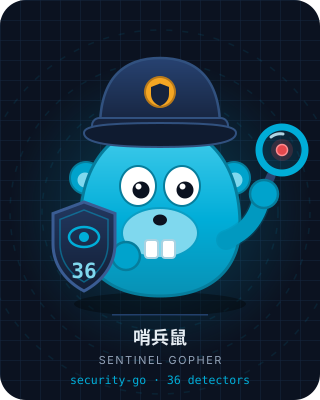
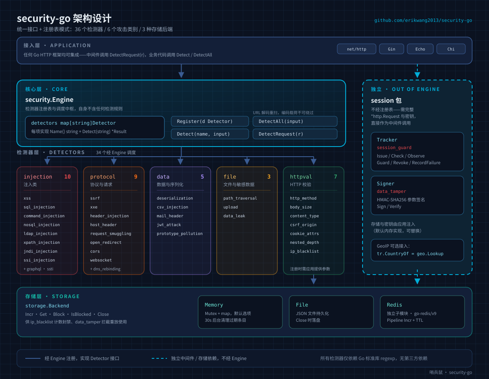
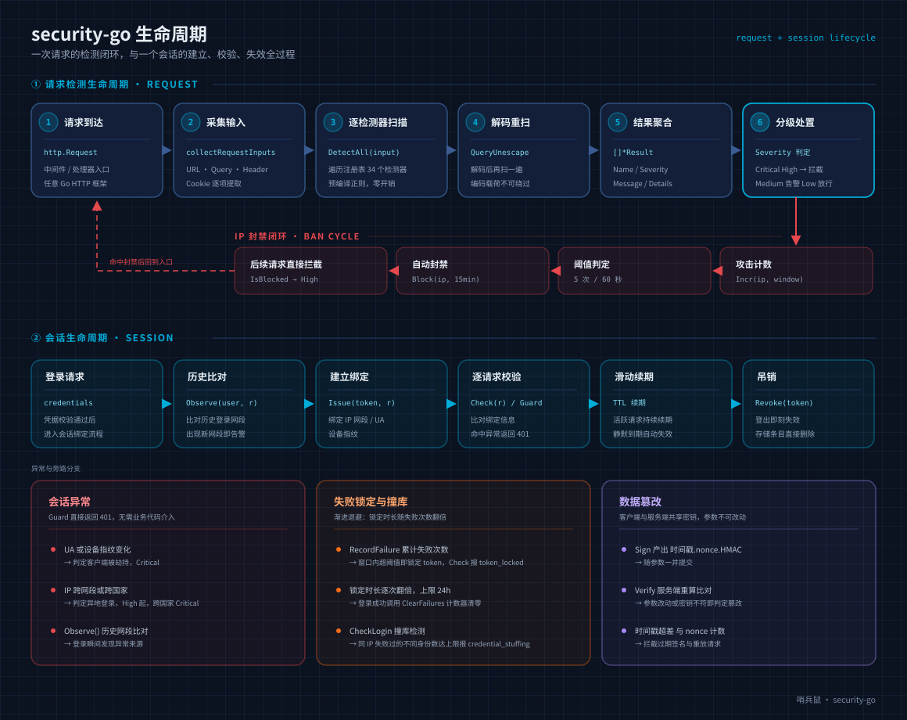
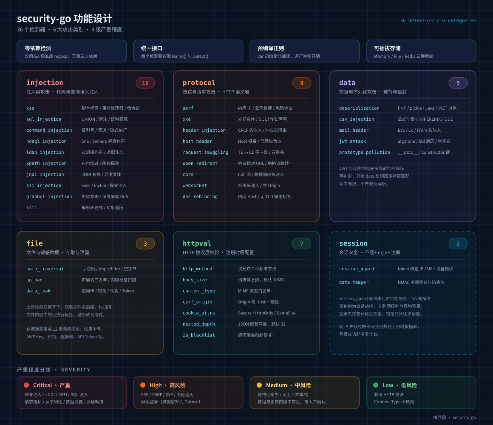

# Security Go — 공격 탐지 라이브러리

[简体中文](../../../README.md) · [English](../../../README-EN.md) · [API 인터페이스 문서](api.md)

Go 언어로 작성된 공격 탐지 패키지로, **36개의 감지기**, **6대 공격 카테고리**, **3가지 플러그형 저장 백엔드**를 지원합니다. 통합 인터페이스 + 등록소 패턴을 사용하는 순수 탐지 라이브러리로, 모든 Go HTTP 프레임워크에 적용할 수 있습니다.

<p align="center">
  
  <br>
  <sub>프로젝트 마스코트 Sentinel Gopher(哨兵鼠) — 방패를 들고 파수를 서는 Go 고퍼. 방패의 36은 감지기 수이고, 돋보기는 요청별 스캔입니다.</sub>
</p>

[설계 아키텍처](#설계-아키텍처) · [구현 기능](#구현-기능) · [수명 주기](#수명-주기) · [프로젝트 구조](#프로젝트-구조) · [마스코트](#마스코트)

## 설계 철학

### 핵심 원칙

- **제로 의존성 탐지** — 모든 감지기는 Go 표준 라이브러리 `regexp`만 사용하며 외부 의존성이 없습니다
- **통합 인터페이스** — 각 감지기는 `Detector` 인터페이스(`Name()` + `Detect()`)를 구현하고, `Engine` 등록소를 통해 통합 관리됩니다
- **사전 컴파일된 정규식** — 모든 패턴은 `var` 초기화 시점에 컴파일되어 런타임 오버헤드가 없습니다
- **필요에 따른 구성** — 주입/프로토콜/데이터/파일 감지기는 플러그 앤 플레이 방식; HTTP 검증기와 세션 보안 감지기는 애플리케이션에서 커스텀 구성이 필요합니다

### 설계 아키텍처



> `session` 패키지는 `Engine` 등록을 거치지 않습니다: 세션 검증은 완전한 `*http.Request`(token, 클라이언트 IP, User-Agent)를 읽어야 하고,
> 애플리케이션이 저장소와 키를 제공해야 하므로 미들웨어로 직접 호출합니다. 아래 「세션 보안 구성」을 참조하세요.

### 수명 주기

요청이 진입해 탐지를 거쳐 등급별 처리로 이어지는 전체 흐름(IP 차단 주기와 URL 디코딩 재검사 포함), 그리고 세션이 바인딩에서 폐기까지 가는 여정:



### 심각도 등급

| 등급 | 설명 | 대표 시나리오 |
|------|------|---------|
| `SeverityLow` | 낮은 위험 | 허용되지 않은 HTTP 메서드, Content-Type 불일치 |
| `SeverityMedium` | 중간 위험 | 약한 신호: CORS 구성 문제, 오픈 리다이렉트, GraphQL 인트로스펙션, 그리고 각 감지기가 의도적으로 분리한 문맥 없는 패턴(`../`, `on…=`, `javascript:`, `sleep(`, `sqlite_master`, 백틱, `{#…#}`, `__proto__:`, PHP 매직 메서드 이름) — 튜토리얼과 일반 콘텐츠에서 흔합니다 |
| `SeverityHigh` | 높은 위험 | 강한 신호: XSS, SQL 주입, SSRF, 경로 순회, 세션 이상 |
| `SeverityCritical` | 심각 | 강한 신호: 명령 주입, JNDI, SSTI, XXE, 데이터 유출, 역직렬화(PHP 직렬화 객체 / pickle / Java / .NET) |

## 구현 기능

### 기능 개요



### 주입형 공격 (10)

| 감지기 | 감지 패턴 |
|--------|---------|
| **XSS** | `<script>`, `on[a-z]+=` 이벤트 핸들러, `javascript:` 가상 프로토콜, SVG/CSS 주입, `eval()`, `document.cookie` |
| **SQL 주입** | `UNION SELECT`(`/**/` 우회 포함), `sleep/benchmark/pg_sleep`, 부울 블라인드, `information_schema` 열거, `xp_cmdshell` |
| **명령 주입** | 백틱, `$()`, 파이프 문자, `/dev/tcp`, PHP `system/exec/shell_exec`, 연쇄 실행 `&&` `;` `\|\|` |
| **NoSQL 주입** | MongoDB `$ne` `$gt` `$regex` `$where` 연산자, `$func`, JSON 키 주입 |
| **LDAP 주입** | 필터 연산자 `(\|(&(!`, `objectClass=*`, URL 인코딩 우회 |
| **XPATH 주입** | 부울 우회 `' or '1'='1`, `string-length()`, `count()` |
| **JNDI/Log4Shell** | `${jndi:ldap://`, `${lower:j}` 난독화, `${env:}` 환경 변수, `ldap/rmi/dns` 프로토콜 |
| **SSI 주입** | `<!--#exec cmd=`, `<!--#include file=`, `<!--#echo var=` |
| **GraphQL 주입** | `__schema`/`__type` 인트로스펙션, 심층 중첩 DoS(5계층 이상), `mutation` 감지 |
| **SSTI** | Jinja2 `{{}}`, FreeMarker `${}`, ERB `<% %>`, Python MRO 순회, `config/self` 접근 |

### 프로토콜 및 요청 공격 (9)

| 감지기 | 감지 패턴 |
|--------|---------|
| **SSRF** | 내부망 IP(127/10/172.16/192.168), `169.254.169.254`, IPv6 루프백, `gopher/dict/file/ftp` 프로토콜 |
| **XXE** | `<!ENTITY SYSTEM/PUBLIC`, 매개변수 엔티티 `%entity;`, DOCTYPE 선언 |
| **HTTP 헤더 주입** | CRLF `%0d%0a` / `\r\n`, Set-Cookie/Location/Content-Length 주입 |
| **Host 헤더 공격** | CRLF Host 주입, `X-Forwarded-Host`, `X-Original-URL` 포이즈닝 |
| **요청 스머글링** | Transfer-Encoding/Content-Length 불일치, 이중 TE 헤더, `\x0b` 폴딩 헤더 난독화 |
| **오픈 리다이렉트** | `//evil.com` 프로토콜 상대 URL, `javascript:/data:` 가상 프로토콜 |
| **CORS 우회** | `Origin: null`, `Access-Control-Allow-*` 헤더 주입 |
| **WebSocket 하이재킹** | Upgrade 헤더 주입, null Origin 우회, `ws://` URL |
| **DNS 리바인딩** | Host 헤더 내부망 IP, localhost, TLD 없는 짧은 호스트명 |

### HTTP 프로토콜 계층 검증 (7)
| **JSON 중첩 깊이** | `json.Decoder`로 스트림 스캔: 중첩 깊이나 요소 수가 한도를 넘으면 JSON 폭탄으로 판정(기본 깊이 32). 잘못되었거나 잘린 JSON은 절대 탐지하지 않습니다 |
| **Cookie 속성** | `Set-Cookie`에 `Secure`/`HttpOnly`/`SameSite` 누락, 값 초과 길이 또는 빈 값 탐지. 누락된 속성은 하나의 결과로 묶습니다 |

| 감지기 | 설명 |
|--------|------|
| **HTTP 메서드** | GET/POST/PUT/DELETE/HEAD/OPTIONS/PATCH만 허용, 그 외는 경고 |
| **요청 본문 크기** | 상한(기본 10MB) 초과 시 경고 |
| **Content-Type** | 구성된 MIME 타입 화이트리스트만 허용 |
| **CSRF Origin** | 크로스 도메인 요청의 Origin과 Host 일치 여부 검사, 추가 화이트리스트 지원 |
| **IP 블랙리스트** | 윈도우 시간 내 N회 공격 시 자동 차단(기본 5회/60초 → 15분 차단), File/Redis/Memory 저장소 지원 |

### 데이터 및 직렬화 공격 (5)

| 감지기 | 감지 패턴 |
|--------|---------|
| **역직렬화** | `O:숫자:` / `C:숫자:` 직렬화 객체, `unserialize()`, 매직 메서드(`__wakeup`/`__destruct`); PHP / pickle / Java / .NET 페이로드 지원 |
| **CSV 주입** | `=cmd\|`, `@SUM(`, `+`/`-` 수식 접두사, `HYPERLINK`/`DDE` |
| **메일 헤더 주입** | Bcc/Cc/From/To 주입, MIME multipart, boundary 매개변수 |
| **JWT 공격** | `alg: none` 우회, `kid` 경로 순회, 빈 서명 감지(구조 디코딩 분석) |
| **프로토타입 폴루션** | `__proto__`/`constructor` 키, `__defineGetter__`/`__defineSetter__` |

### 파일 및 민감 데이터 (3)

| 감지기 | 감지 패턴 |
|--------|---------|
| **경로 순회** | `../`, `..\\`, `php://filter`/`php://input`, null 바이트, URL 인코딩 우회, `/etc/passwd` |
| **악성 업로드** | 확장자 화이트리스트(15종) + PHP 태그 `<?php`/`<?=` 콘텐츠 스캔 |
| **데이터 유출** | 신용카드 번호, AWS Access Key, 개인 키 `-----BEGIN`, DB 연결 문자열, API Token, JWT Secret, GitHub PAT |

### 세션 보안 (2)

| 감지기 | 감지 패턴 |
|--------|---------|
| **세션 가드** (`session_guard`) | 세션 생성 시점의 클라이언트 바인딩을 token에 묶어 매 요청마다 비교: User-Agent 또는 기기 지문 변경 시 **클라이언트 하이재킹**(Critical)으로 판정; 클라이언트 IP가 다른 네트워크 대역이나 국가로 바뀌면 **원격 로그인**(High/Critical)으로 판정; `Observe()`는 로그인 시 과거 네트워크 대역과 비교하여 새 대역이 나타나면 경고합니다. 세션은 슬라이딩 갱신되며 `Revoke()`로 즉시 무효화할 수 있습니다; `RecordFailure()`가 실패 횟수를 세어 윈도우 내 임계값에 도달하면 토큰을 잠그고, `Check()`는 `token_locked`를 보고하며, 로그인 성공 시 `ClearFailures()`가 횟수를 초기화합니다; `CheckLogin()`은 추가로 크리덴셜 스터핑을 탐지하며(한 클라이언트가 너무 많은 서로 다른 식별자에 실패하면 `credential_stuffing`), 잠금은 반복마다 두 배로 늘어 최대 24시간입니다 |
| **데이터 변조** (`data_tamper`) | 요청 파라미터에 HMAC-SHA256 서명(`타임스탬프.nonce.서명`)을 적용하여 파라미터 변경, 키 불일치, 타임스탬프 초과, 서명 재전송(nonce 카운터)을 식별합니다 |

### 저장 백엔드 (3)

| 백엔드 | 설명 |
|------|------|
| **Memory** | `sync.Mutex` + map, 30초마다 만료 항목 자동 정리 |
| **File** | JSON 파일 영속화, Close 시 flush |
| **Redis** | 독립 서브모듈, Pipeline Incr + TTL, `go-redis/v9` 필요 |

## 프로젝트 구조

```
security-go/
├── security.go            # 코어: Result / Severity / Detector 인터페이스 / Engine 등록소
├── injection/             # 주입 감지기 (10): xss, sql, command, nosql, ldap,
│                          #   xpath, jndi, ssi, graphql, ssti
├── protocol/              # 프로토콜 및 요청 감지기 (9): ssrf, xxe, header, host,
│                          #   smuggling, redirect, cors, websocket, dns_rebinding
├── data/                  # 데이터 및 직렬화 감지기 (5): deserialization, csv,
│                          #   mail, jwt, prototype_pollution
├── file/                  # 파일 및 민감 데이터 감지기 (3): path_traversal,
│                          #   upload, data_leak
├── httpval/               # HTTP 프로토콜 검증기 (7), 각각 앱이 제공하는 설정 필요
├── session/               # 세션 보안 (2): session_guard, data_tamper
│                          #   Engine을 우회하여 미들웨어로 직접 사용
├── storage/               # 저장 백엔드
│   ├── storage.go         #   Backend 인터페이스: Incr / Get / Block / IsBlocked / Close
│   ├── memory.go          #   Memory: Mutex + map, 30초 백그라운드 정리
│   ├── file.go            #   File: JSON 영속화, Close 시 flush
│   └── redis/             #   Redis: 자체 go.mod를 가진 별도 서브모듈
├── all/                   # 27개 무설정 감지기를 한 번에 등록
├── pet/                   # 프로젝트 마스코트: 내장 SVG + 시작 배너
├── docs/
│   ├── api.md             # API 레퍼런스
│   ├── images/            # 아키텍처 / 기능 / 수명 주기 SVG
│   ├── i18n/              # 번역 문서 (12개 언어)
│   └── superpowers/       # 설계 규격, 구현 계획, 코드 리뷰 보고서
└── tests/                 # 커버리지 보고서
```

각 감지기 패키지는 `xxx.go`와 `xxx_test.go`를 짝지으며, `all`은 추가로 회귀 테스트를 포함합니다.

## 사용 방법

### 설치

```bash
go get github.com/erikwang2013/security-go
```

### 빠른 시작

```go
package main

import (
    "fmt"
    "github.com/erikwang2013/security-go"
    "github.com/erikwang2013/security-go/all"
)

func main() {
    e := security.NewEngine()
    all.RegisterAll(e) // 27개 무설정 감지기를 한 번에 등록

    // 단일 감지
    r := e.Detect("xss", "<script>alert(1)</script>")
    fmt.Printf("감지됨: %v, 심각도: %d\n", r.Detected, r.Severity)

    // 전체 감지
    for _, r := range e.DetectAll("' OR '1'='1") {
        fmt.Printf("[%s] %s\n", r.Name, r.Message)
    }
}
```

### HTTP 요청 감지

```go
func handler(w http.ResponseWriter, r *http.Request) {
    e := security.NewEngine()
    all.RegisterAll(e)

    for _, result := range e.DetectRequest(r) {
        if result.Detected {
            log.Printf("공격 감지: [%s] %s", result.Name, result.Message)
        }
    }
}
```

### HTTP 검증기 구성

```go
// 메서드 검증
e.Register(&httpval.Method{})

// 요청 본문 크기 제한
e.Register(httpval.NewBodySize(5 * 1024 * 1024)) // 5MB

// Content-Type 화이트리스트
e.Register(httpval.NewContentType([]string{
    "application/json", "application/x-www-form-urlencoded",
}))

// CSRF Origin 검사
e.Register(&httpval.CSRFOrigin{
    Host: "example.com", AllowList: []string{"api.example.com"},
})

// IP 블랙리스트 (자동 차단: 5회/60초 → 15분 차단)
mem := storage.NewMemory()
defer mem.Close()
bl := httpval.NewIPBlacklist(mem)
e.Register(bl)

// 공격 발생 시 기록
blocked, _ := bl.RecordAttack(clientIP)
```

### 세션 보안 구성

`session` 패키지는 `Engine`을 거치지 않고 미들웨어로 직접 사용합니다. 저장소는 애플리케이션이 직접 준비해야 합니다(기본으로 메모리 구현을 제공하며, Redis 등으로 교체 가능):

```go
import "github.com/erikwang2013/security-go/session"

st := session.NewMemoryStore()
defer st.Close()

tr := session.NewTracker(st)
tr.CountryOf = geo.Lookup // 선택 사항: GeoIP를 연동해 국가 간 로그인 식별

// 로그인 성공 후 세션 바인딩 (token은 로그인 흐름에서 생성)
// 원격 로그인 감지: 사용자의 과거 로그인 네트워크 대역과 비교해 새 대역이 나타나면 경고
if res := tr.Observe("user-1", r); res.Detected {
    log.Printf("[%s] %s (%v)", res.Name, res.Message, res.Details["reason"])
}
if err := tr.Issue(token, r); err != nil {      // token → IP 대역 / UA / 기기 지문 바인딩
    http.Error(w, "session error", http.StatusInternalServerError)
    return
}

// 보호 라우트: 하이재킹이나 원격 로그인 시 즉시 401 반환
mux.Handle("/api/", tr.Guard(apiHandler))

// 또는 감지만 하고 직접 대응 결정
if res := tr.Check(r); res.Detected {
    log.Printf("[%s] %s (%v)", res.Name, res.Message, res.Details["reason"])
}

// 로그아웃
tr.Revoke(token)
```

데이터 변조 감지: 클라이언트와 서버가 공유 키를 사용하며, 클라이언트가 파라미터에 서명하고 서버가 재계산하여 검증합니다:

```go
signer := session.NewSigner(secret, storage.NewMemory()) // 두 번째 인자는 서명 재전송 차단용, nil 가능

sig, _ := signer.Sign(map[string]string{"amount": "100", "to": "bob"}) // 클라이언트: 파라미터와 함께 제출

if res := signer.Verify(map[string]string{"amount": "100", "to": "bob"}, sig); res.Detected {
    log.Printf("[%s] %s (%v)", res.Name, res.Message, res.Details["reason"])
}
```

> `TrustProxyHeaders`는 기본적으로 비활성화됩니다: `X-Forwarded-For` / `X-Real-IP`는 클라이언트가 제어할 수 있으므로 자체 리버스 프록시 뒤에서만 활성화하세요.
> `FailClosed`는 기본적으로 비활성화됩니다(저장소 장애 시 통과, `IPBlacklist`와 동일); 세션에 민감한 서비스는 활성화를 권장합니다.

### 사용자 정의 감지기

```go
type MyDetector struct{}

func (d *MyDetector) Name() string { return "my_detector" }

func (d *MyDetector) Detect(input string) *security.Result {
    return &security.Result{
        Name: "my_detector", Detected: strings.Contains(input, "evil"),
        Severity: security.SeverityHigh, Message: "악성 콘텐츠 감지됨",
    }
}

e.Register(&MyDetector{})
```

### 마스코트

`pet` 패키지는 `go:embed`로 컴파일 시점에 Sentinel Gopher를 SVG로 임베드합니다 — 런타임 파일 의존성도, 추가 서드파티 의존성도 없습니다:

```go
import "github.com/erikwang2013/security-go/pet"

log.Println(pet.Banner())              // 시작 배너: 터미널 친화적 일반 텍스트
http.Handle("/pet.svg", pet.Handler()) // 디버그 라우트: image/svg+xml로 제공, 1일 캐시
svg := pet.SVG()                       // 또는 원시 SVG 바이트를 그대로
```

### 관련 문서

- [API 인터페이스 문서](api.md) — 핵심 타입, Detector/Engine 인터페이스, 저장 백엔드 인터페이스, HTTP 검증기
- [설계 규격](specs/2026-07-29-attack-detection-design.md) — 패키지 구조, 감지기 목록
- [구현 계획](plans/2026-07-29-attack-detection-plan.md) — 단계별 작업 계획과 구현 이탈 대조
- [코드 리뷰 보고서](reports/2026-07-29-code-review-report.md) — Bug 수정, 테스트 커버리지, 아키텍처 평가
- [코드 리뷰 보고서 v2](reports/2026-07-29-code-review-report-v2.md) — 2차 검토: 문제 4건 수정, 테스트 파일 18개 추가

---

## 다국어 문서

| 언어 | 문서 |
|------|------|
| 简体中文 | [README.md](../../../README.md) |
| English | [README.md](../en/README.md) |
| 한국어 | [README.md](README.md) |
| Русский | [README.md](../ru/README.md) |
| Deutsch | [README.md](../de/README.md) |
| Français | [README.md](../fr/README.md) |
| Español | [README.md](../es/README.md) |
| Português | [README.md](../pt/README.md) |
| हिन्दी | [README.md](../hi/README.md) |
| العربية | [README.md](../ar/README.md) |
| বাংলা | [README.md](../bn/README.md) |
| Bahasa Indonesia | [README.md](../id/README.md) |
| 日本語 | [README.md](../ja/README.md) |

문서 색인: [docs/i18n/README.md](../README.md)

---

## 후원 지원

이 프로젝트가 도움이 되었다면 후원으로 지원해 주세요:

| 방식 | QR 코드 |
|------|--------|
| 알리페이 |  |
| 위챗페이 |  |

### 해외 송금 후원 (은행 송금)

**수취인 정보**

- 수취인 이름: WANG KEXUN
- 수취 계좌 번호: 881015918251

**수취 은행 (ZA Bank)**

- SWIFT Code: `AABLHKHHXXX`
- 은행 이름: ZA Bank Limited
- 은행 번호: 387
- 은행 주소: Core F, Cyberport 3, 100 Cyberport Road, Hong Kong

**해외 송금 중계 은행 (필요 시)**

> 참고: 이 정보는 해외 송금 중계 은행(중개 은행) 정보이며, 수취 은행 정보가 아닙니다. 송금 은행에 중계 은행 정보 제공이 필요한지 문의하세요.

- 홍콩 달러, 위안화 및 미국 달러 송금 시 중계 은행은 Citibank입니다:
  - 은행 이름: Citibank N.A. Hong Kong
  - SWIFT Code: `CITIHKHXXXX`
  - 은행 번호: 006
  - 지점 이름: Hong Kong Branch
  - 지점 번호: 391
  - 은행 주소: Citibank Tower, Citibank Plaza, 3 Garden Road, Central, Hong Kong
- 기타 통화 송금 시 중계 은행은 BNY Mellon입니다:
  - 은행 이름: THE BANK OF NEW YORK MELLON
  - SWIFT Code: `IRVTUS3NXXX`
  - 은행 주소: THE BANK OF NEW YORK MELLON, 240 GREENWICH STREET, NEW YORK, United States

---

## English

전체 영문 문서는 [README-EN.md](../../../README-EN.md)를 참조하세요.

---

Copyright (c) 2026 erik <erik@erik.xyz> — https://erik.xyz
